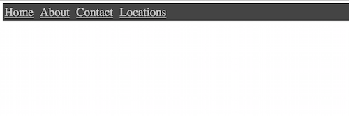
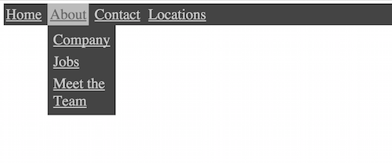

# CSS Navigation Challenge

## Challenge

- Build a navigation using Semantic Markup
	- There should be 4 top level navigation items: **Home**, **About**, **Contact**, **Locations**.
	- Do not use un-ordered or ordered lists in your markup.
- Add a dropdown menu for the **About** navigation item.
	- When the user moves the mouse over the **About** navigation item the dropdown menu should show.
	- The dropdown menu should have 3 navigation items: **Company**, **Jobs**, **Meet The Team**.
	- **Do not use Javascript to show the dropdown**.

### Comps 

### Stretch goals

- The dropdown should be animated in to place.
- Have a secondary dropdown from the **Jobs** navigation item that contains two items: **Full-time** and **Part-time**.
